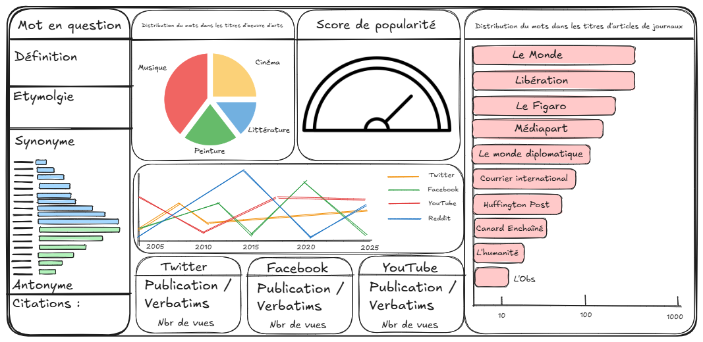

# L-observatoire-du-mot
Rapport Excel automatisé en Python

## Introduction – L’Observatoire du mot

Qu’est-ce qu’un mot ? On croit souvent que comprendre un mot, c’est être capable de le définir. Pourtant, dans le langage ordinaire, les mots ne sont pas d’abord des objets de définition : ce sont des outils d’usage.

Prenons pour exemple le mot « seum ». Se trouve-t-il dans le dictionnaire ? Peut-être. Mais même lorsqu’il y figure, la définition n’en fait que documenter un usage préexistant. Ce mot, comme tant d’autres, est d’abord appris par immersion, en l’entendant dans des situations précises puis en l’utilisant soi-même. On comprend un mot parce qu’on sait quand et comment l’utiliser – non parce qu’on est capable d’en réciter une définition. Les mots que l’on connait ne sont pas forcément des mots que l’on sait définir mais plutôt des mots que l’on sait utiliser. Comme l’écrivait Wittgenstein dans *Le Cahier Bleu* à ce sujet : « Nous sommes incapables de circonscrire clairement les concepts que nous utilisons ; non parce que nous ne connaissons pas leur vraie définition, mais parce qu'ils n'ont pas de vraie "définition". Supposer qu'il y en a nécessairement serait comme supposer que, à chaque fois que des enfants jouent avec un ballon, ils jouent en respectant des règles strictes.» (Wittgenstein, *Le Cahier bleu*, [25-26], trad. M. Goldberg et J. Sackur, Gallimard, p. 67-69).

*L’Observatoire du mot* naît de ce constat : un mot est bien plus qu’une entrée dans un dictionnaire. Comprendre un mot, c’est plonger dans son usage vivant, ses contextes, ses résonances culturelles et sociales. L’utilisateur ne reçoit pas un portrait figé du mot de son choix, mais une matière vivante de l’explorer. L’Observatoire du mot est un outil hybride entre **dictionnaire augmenté** et cartographie culturelle pour toute personne curieuse de comprendre non seulement ce que signifie un mot mais également de connaître sa place dans le monde.

## Objectifs et ambitions de *l'Observatoire du mot*

Notre objectif est de créer un programme Python permettant à l’utilisateur de saisir un mot, puis de générer un fichier Excel structuré, interactif et partageable. Ce fichier sera produit à l’aide de la librairie openpyxl. Voici la forme du ficher Excel que nous souhaitons produire :

Cette maquette de **tableau de bord** est inférée de la liste suivante présentant les « dimensions » d’un mot que nous aimerions explorer et visualiser :

- **Dimension sémantique** : définitions / étymologie / synonymes / antonymes / citations célèbres / traductions.
- **Dimension culturelle** : apparition du mot dans les titres d’œuvres d’art
- **Dimension sociale** via les réseaux sociaux
  - Récupérer les tops tweet/threads/commentaires/titres de vidéos/hashtags contenant le mot
  - Co-occurrences : avec quels autres mots notre mot se retrouve-t-il le plus ? 
  - **Dimension statistique** : 
    - évolution de la fréquence d’apparition du mot
	- Donner un score de popularité (étoiles)
- **Dimension médiatique** via médias.
  - Retrouver les articles de l'actualité contenant ce mot.
